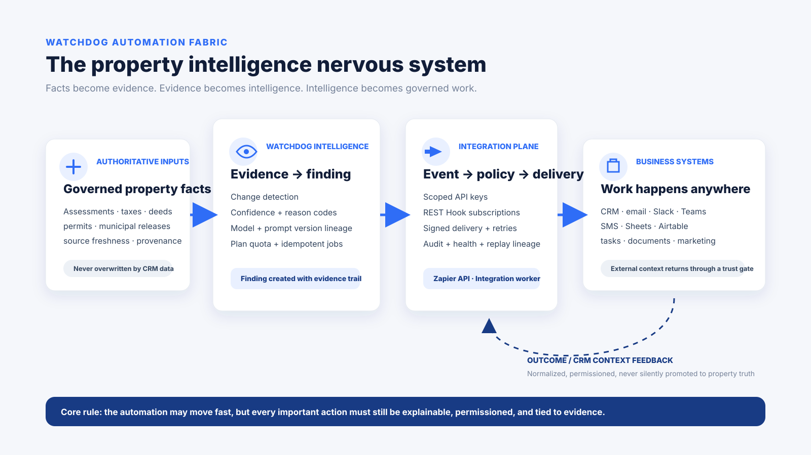
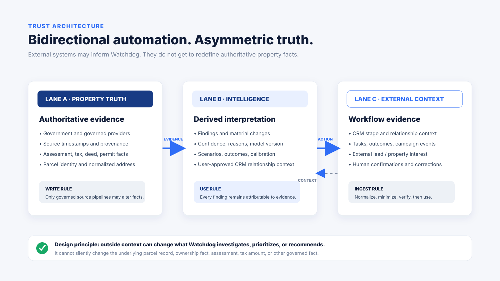
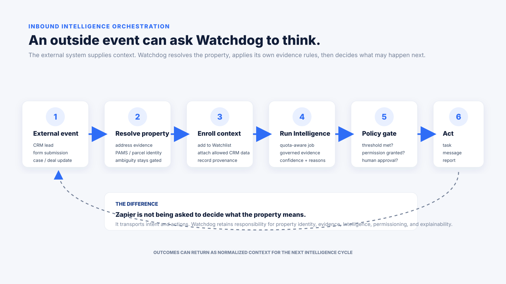
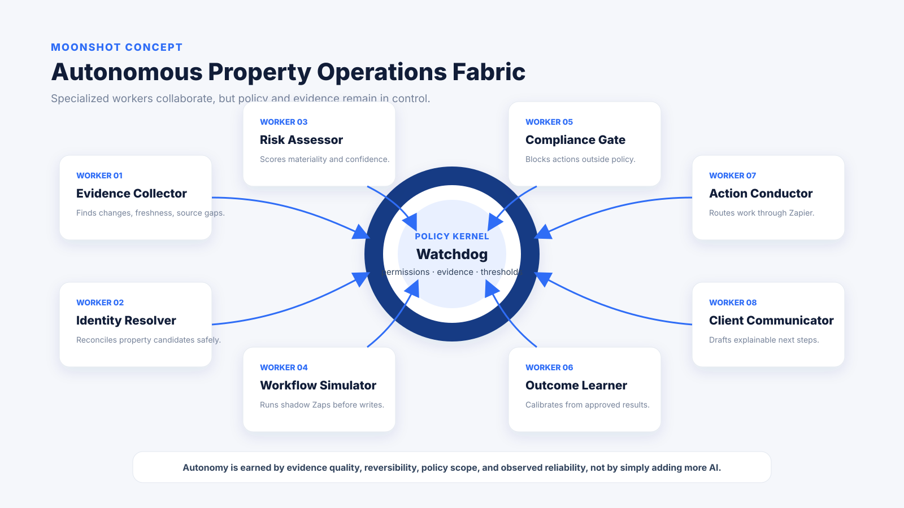

# Watchdog Automation Fabric
## Zapier + Watchdog Intelligence
### A living whitepaper, integration architecture, operating guide, and research agenda

**Version:** 0.1  
**Date:** August 19, 2026  
**Status:** Living product and engineering document  
**Primary roadmap:** Linear NJW-230 and its successors  
**Scope:** Watchdog Integration Platform, Zapier, native CRM connectors, Watchdog Intelligence, evidence governance, automation policy, observability, and future agentic orchestration

> **Core thesis:** Watchdog should not become another property-data API connected to Zapier. It should become a governed property-intelligence operating layer in which verified facts become evidence, evidence becomes Intelligence, Intelligence becomes policy-constrained work, and the result of that work can safely return as context for the next decision.



---

## 1. Executive summary

Most software integrations answer a simple question: **how do we move a record from System A to System B?**

Watchdog has the opportunity to answer a harder and more valuable question:

**Given a property, its changing authoritative facts, its evidence history, its relationship to a user or CRM record, and the user's business policy, what should happen next, why should it happen, and what proof should travel with the action?**

Zapier is important because it already connects thousands of business tools and gives users a familiar way to assemble cross-application workflows. Watchdog Intelligence is important because it can supply the property-specific reasoning layer that ordinary automation platforms do not possess. The combination creates a product category that is larger than a connector catalog.

The proposed model has four layers:

1. **Property truth layer**  
   Governed parcel identity, assessments, taxes, deeds, permits, municipal and state data, source timestamps, historical changes, data quality, and provenance.

2. **Watchdog Intelligence layer**  
   Findings, material-change detection, confidence, reason codes, model versions, scenarios, evidence chains, calibration, outcome learning, temporal monitoring, and professional context.

3. **Automation and policy layer**  
   Zapier REST Hooks, actions, searches, API-key scopes, idempotency, retry rules, thresholds, approvals, organization routing, rate limits, audit logs, and future policy compilation.

4. **Business execution layer**  
   CRM, email, SMS, Slack, Teams, task systems, spreadsheets, document systems, marketing tools, call platforms, underwriting tools, case-management systems, and future AI agents.

The architecture should remain **bidirectional but asymmetrically trusted**. External systems may supply relationship context, workflow outcomes, user intent, lead data, and action results. They do not silently overwrite authoritative property facts.

This principle is the foundation of the entire integration strategy.

---

## 2. The opportunity: from data delivery to intelligence orchestration

Traditional property-data products are usually organized around one or more of these capabilities:

- look up a parcel;
- return property attributes;
- search and filter a dataset;
- export records;
- provide an API;
- monitor a property for changes;
- enrich a CRM or internal application.

Those are useful capabilities, and Watchdog should continue to do them well. They are not the endpoint.

The more defensible position is to make Watchdog the place where **property identity, source evidence, temporal change, professional context, and action policy intersect**.

For example, a normal data integration might say:

> Assessment changed from $310,000 to $356,000. Send the new value to the CRM.

A Watchdog Intelligence workflow should be able to say:

> The governed assessment changed 14.8%. The source is current and confidence is high. The property's tax burden, prior assessment history, current municipal ratio, user relationship, and saved workflow policy make this a material event. Create an attorney review task, attach the evidence IDs, notify the assigned professional, and hold client outreach until a human approves the recommended explanation.

The second workflow is not merely data movement. It is **evidence-aware operations**.

That is the long-term product thesis.

### Market context, without overstating novelty

Modern property-data vendors already provide strong APIs. Regrid documents parcel search, schema discovery, address lookup, query-by-fields, and standardized parcel data. BatchData documents broad property, ownership, mortgage, tax, transaction, permit, contact, and property-monitoring APIs. These capabilities demonstrate that rich real-estate data infrastructure is an established category.

Watchdog's intended differentiation is therefore not the unsupported claim that no other company can deliver property data or change events. The proposed differentiation is the **combination** of:

- governed New Jersey property truth;
- temporal source monitoring;
- property-specific Intelligence;
- explicit evidence and confidence;
- verified CRM-to-property relationships;
- bidirectional context with asymmetric trust;
- policy-gated automation;
- explainable downstream actions;
- closed-loop outcome learning;
- shadow simulation before automation is allowed to act.

This document does **not** claim worldwide patent novelty for the moonshot concepts below. Establishing that would require a separate patent, prior-art, and competitive research program. The ideas are presented as category-defining product bets designed to push Watchdog beyond ordinary property-data integration patterns.

---

## 3. Design doctrine

The integration platform should be evaluated against the following rules before a feature is considered complete.

### 3.1 Governed facts remain authoritative

CRM records, lead forms, notes, spreadsheets, and third-party automation outputs are context. They are not automatically property truth.

A CRM field stating `owner = John Smith` must not replace a governed ownership record. A lead form claiming `taxes = 9000` must not overwrite a sourced annual-tax fact. An AI agent claiming a permit exists must not create a permit fact without governed evidence.

### 3.2 Outside context may change what Watchdog investigates

External context can legitimately change:

- which property is prioritized;
- which Intelligence model is run;
- which scenario is evaluated;
- which workflow is recommended;
- which professional receives the result;
- which communication is drafted;
- which task is opened;
- which outcome is recorded.

This allows Watchdog to be deeply integrated without surrendering its evidence discipline.

### 3.3 Every important automated action should be explainable

A downstream action should eventually be able to answer:

- What property caused this?
- What changed?
- Which source established the fact?
- When was that source checked?
- Which Intelligence model evaluated it?
- What confidence and reason codes were produced?
- Which workflow policy matched?
- Which permission allowed the action?
- Was human approval required?
- What happened after the action?

### 3.4 Automation must be idempotent

Retries, duplicate provider notifications, browser refreshes, Zap retries, and job restarts must not create duplicate irreversible work.

A stable idempotency key should exist wherever an action can create cost, communication, a task, a report, a marketing operation, or an Intelligence job.

### 3.5 Ambiguity fails closed

If a CRM address resolves to multiple parcels, Watchdog should create a candidate for review instead of choosing one. If evidence is stale, low-confidence, contradictory, or incomplete, the automation should reduce privilege rather than invent certainty.

### 3.6 Permissions are capabilities, not decoration

The current separation between scopes such as `property.read`, `watchlist.write`, `crm.context.write`, `intelligence.read`, and `intelligence.run` should expand over time.

A future integration should receive only the capabilities it needs.

### 3.7 Autonomy is earned

A workflow should gain more autonomy only when the action is reversible, the evidence is strong, observed reliability is high, policy allows it, and the user has granted the required authority.

Sending an internal Slack message and launching a paid marketing campaign should not have the same approval standard.

---

## 4. Asymmetric trust architecture



The platform should continue to operate in three separate conceptual lanes.

### Lane A: Property truth

Examples:

- PAMS / parcel identity;
- assessment;
- annual property tax;
- deed and sale facts;
- permit facts;
- municipal or state releases;
- source freshness;
- authoritative geometry and normalized property address;
- governed provider observations.

Only governed source pipelines should be able to modify these facts.

### Lane B: Watchdog Intelligence

Examples:

- findings;
- opportunity or risk scores;
- reason codes;
- confidence;
- material-change classification;
- scenarios;
- temporal comparison;
- evidence-chain references;
- model and prompt versions;
- professional workflow interpretation.

This lane may use allowed external context, but every finding should remain attributable to its inputs.

### Lane C: External workflow context

Examples:

- CRM stage;
- source of a lead;
- assigned professional;
- task completion;
- property of interest;
- user-confirmed relationship;
- outreach outcome;
- case status;
- approved marketing result.

This data should be normalized and minimized before Intelligence can use it.

---

## 5. Production foundation as of August 19, 2026

This whitepaper begins from a real production base rather than a hypothetical architecture.

### 5.1 Active integration runtime

The current Supabase production project has active Integration Platform functions including:

- `integration-gateway`
- `integration-webhook`
- `integration-delivery-worker`
- `integration-key-manager`
- `zapier-api`
- `integration-provider-manager`
- `integration-provider-sync-worker`
- `integration-crm-resolution-worker`
- `integration-crm-resolver`
- `intelligence-crm-context`
- `intelligence-crm-analyst`

The broader Intelligence runtime also includes job submission and worker functions, semantic context, analyst and scenario functions, model shadow evaluation, source-fact monitoring, calibration, and team operations.

### 5.2 Integration persistence and audit plane

The production database contains dedicated integration tables for:

- API keys;
- audit log;
- connections;
- normalized CRM context;
- CRM-to-property relationship links;
- CRM resolution state;
- event records;
- deliveries;
- delivery attempts;
- field mappings;
- provider connections;
- provider sync runs;
- runtime configuration.

This is important. A serious integration product requires its own operational state, not a pile of anonymous webhooks.

### 5.3 Intelligence persistence

The production Intelligence system includes dedicated data structures for jobs, runs, findings, evidence batches, feedback, model and feature versions, prompt versions, calibration cases and reviews, outcome events, usage events, daily digests, semantic snapshots, assumptions, intent state, material-change candidates, source-fact monitoring, and value snapshots.

That is the basis for future automation with memory, evidence, and measurable outcomes.

---

## 6. Watchdog for Zapier v1.1

The current connector surface is intentionally small enough to understand while already enabling meaningful workflows.

### 6.1 Instant triggers

| Trigger | Purpose | Important boundary |
|---|---|---|
| Property Signal Changed | React to governed property signal changes | Fact source remains Watchdog |
| Watchlist Alert | React to an alert on a saved property | Subscription and plan rules apply |
| Report Ready | Act when a Watchdog report is complete | Delivery should preserve report lineage |
| Intelligence Finding Created | React to a new Intelligence finding | Requires explicit Intelligence access |

Zapier's current publishing guidance prefers REST Hook based instant triggers over static webhook configuration for public integrations. Watchdog's architecture follows that model.

### 6.2 Searches

| Search | Purpose |
|---|---|
| Find Property | Resolve a property through the governed Watchdog property surface |
| Get Governed Property Snapshot | Retrieve a bounded, governed property snapshot for use in a Zap |

### 6.3 Actions

| Action | Purpose | Safety model |
|---|---|---|
| Add Property to Watchlist | Enroll a property in Watchdog monitoring | Stable property identity required |
| Remove Property from Watchlist | Remove Watchlist enrollment | Revocable lifecycle action |
| Send CRM Context to Watchdog | Attach allowlisted external context | CRM context remains separate from property facts |
| Run Watchdog Intelligence for Property | Queue a single-property Intelligence job | Uses Watchdog plan quotas and idempotent job infrastructure |

### 6.4 Current Zapier key scopes

The production self-service key contract includes:

```text
zapier.auth
triggers.manage
property.read
watchlist.write
crm.context.write
intelligence.read
intelligence.run
```

Intelligence read and run privileges are separated. An integration that needs to receive a finding does not automatically need authority to run new Intelligence jobs.

### 6.5 Authentication direction

Zapier currently identifies OAuth v2 as the preferred connection experience where possible and API Key authentication as the next-best option. API Key integrations can be published when users can obtain their keys without human intervention.

Watchdog already has a self-service, one-time-reveal, revocable key model. Therefore OAuth should be treated as a later connection-experience improvement rather than a blocker for the first public release.

---

## 7. User setup and operating guide

This section is intended to evolve into the permanent integration manual.

### 7.1 Before creating a Zap

A user should know:

- which Watchdog account or organization the Zap belongs to;
- which property scope the workflow may access;
- whether the Zap only reads property data or may also mutate Watchlists;
- whether CRM context may be sent into Watchdog;
- whether the Zap may receive Watchdog Intelligence;
- whether the Zap may start a new Intelligence run;
- which external system will receive the action;
- whether the downstream action is reversible or costly.

### 7.2 Create a Watchdog Zapier key

The Integration Center should remain the only normal self-service place to create the key.

Recommended workflow:

1. Open Watchdog Integration Center.
2. Create a new Zapier key with a descriptive label such as `Production - Agent CRM`.
3. Select only the required scopes.
4. Copy the one-time-reveal key into Zapier's authentication flow.
5. Store no copy in a spreadsheet, email, CRM note, browser page source, or source repository.
6. Confirm the connection.
7. Return to Watchdog to verify the key appears as active.

### 7.3 Scope selection examples

**Alert-only Zap**

```text
zapier.auth
triggers.manage
property.read
intelligence.read
```

**CRM enrichment Zap**

```text
zapier.auth
property.read
crm.context.write
```

**External lead to Watchdog analysis Zap**

```text
zapier.auth
property.read
watchlist.write
crm.context.write
intelligence.run
```

### 7.4 Build an instant-trigger Zap

Example: high-priority Intelligence finding to CRM task.

1. Choose Watchdog as the trigger app.
2. Select `Intelligence Finding Created`.
3. Connect the appropriate Watchdog key.
4. Pull a sample finding.
5. Add a Zapier Filter or Paths step for the business threshold.
6. Create or update the CRM task/activity.
7. Include the Watchdog event/finding identifier in the external activity.
8. Add the appropriate notification step.
9. Test the complete Zap.
10. Turn the Zap on and confirm at least one successful run in Zap History.

### 7.5 Build an inbound Intelligence Zap



Example: external lead to Watchdog analysis.

1. Trigger from a CRM, lead form, spreadsheet, or other Zapier app.
2. Obtain or resolve the property's governed Watchdog identity.
3. Add the property to Watchlist if the workflow requires monitoring.
4. Send only allowlisted CRM relationship context to Watchdog.
5. Run Watchdog Intelligence for the property.
6. Wait for the resulting finding through the appropriate Watchdog trigger or downstream pattern.
7. Apply a threshold or policy gate.
8. Create the external task, message, report, or follow-up.
9. Store Watchdog identifiers in the external activity for audit linkage.

### 7.6 Key rotation and revocation

Keys should be designed to be disposable.

Operational policy:

- create separate keys for materially different production workflows;
- never reuse a developer/test key as a permanent production credential;
- revoke a key when an employee, contractor, automation owner, or receiving system no longer needs it;
- rotate keys after suspected exposure;
- show last-used and health information in Watchdog;
- treat repeated authentication failures as an incident signal.

### 7.7 Retries

A retry should never mean “do the same irreversible thing again and hope.”

For every action class, define:

- idempotency key;
- maximum attempts;
- retryable HTTP/error classes;
- terminal failures;
- backoff strategy;
- user-visible health state;
- whether manual replay is allowed.

### 7.8 Troubleshooting decision tree

**Zap cannot connect**

- confirm key status;
- confirm the key was copied exactly once from Watchdog;
- confirm required authentication scope;
- revoke and recreate if exposure is suspected.

**Trigger is connected but no event arrives**

- confirm the Zap is on;
- confirm the REST Hook subscription exists;
- confirm the Watchdog event type matches the trigger;
- confirm plan/connection permissions;
- for Intelligence findings, confirm explicit Intelligence access is enabled;
- inspect Watchdog delivery health and Zap History.

**Duplicate external tasks appear**

- identify whether the external app action supports native deduplication;
- confirm the Watchdog event/finding ID is used in the idempotency strategy;
- inspect delivery attempts and Zap retries;
- never fix duplicates by suppressing legitimate Watchdog events globally.

**CRM context appears but property facts do not change**

- this is normally correct behavior;
- CRM context is not permitted to overwrite authoritative property truth;
- verify whether the user expected a relationship-context change or an authoritative source update.

---

## 8. Automation Recipes

Watchdog should market integrations as business outcomes, not endpoint configuration.

### Recipe 1: High-priority opportunity routing

**Trigger:** Intelligence Finding Created  
**Policy:** confidence and opportunity threshold  
**Actions:** create CRM task, notify assigned professional, optionally tag activity  
**Value:** strong findings become work without requiring users to monitor another inbox.

### Recipe 2: Watched property changed

**Trigger:** Watchlist Alert  
**Policy:** relevant change category  
**Actions:** create follow-up task, notify team, preserve Watchdog event ID  
**Value:** material property changes are routed immediately.

### Recipe 3: Report delivery

**Trigger:** Report Ready  
**Actions:** email client/team, save artifact, log CRM delivery activity  
**Value:** repeatable client reporting and delivery history.

### Recipe 4: Investor acquisition pipeline

**Trigger:** Intelligence Finding Created  
**Policy:** opportunity type, score, confidence  
**Actions:** acquisition sheet/CRM, manager alert, diligence task  
**Value:** Watchdog becomes an upstream property-sourcing signal.

### Recipe 5: External lead to Watchdog Intelligence

**Trigger:** any suitable external Zapier app  
**Actions:** resolve property, add Watchlist, send bounded CRM context, run Intelligence  
**Value:** outside business events can cause Watchdog to investigate a property using Watchdog's own evidence system.

---

## 9. Recommended next product steps

The next work should deepen the primitives that every Zap can reuse instead of creating dozens of one-off branded connectors.

### Phase A: Public Zapier beta and publication readiness

**Priority: immediate**

1. Register or link the Watchdog integration in Zapier Developer Platform.
2. Push connector v1.1.0.
3. Run Zapier CLI tests and validation.
4. Build a live test Zap for every visible trigger, search, and action.
5. Retain successful Zap History runs.
6. Create a non-expiring Zapier support test account with appropriate product access.
7. Publish Watchdog API documentation required for review.
8. Create launch metadata and support documentation.
9. Recruit real beta users and collect workflow evidence.
10. Submit for Zapier review when requirements are met.

Zapier's current publishing requirements state that the application must be publicly launched, its APIs documented, its integration production-ready, and every trigger/action/search tested in live Zaps with successful Zap History. The public integration process proceeds through review and Beta before full public status.

### Phase B: Operational depth

Build these primitives next:

#### Trigger: Integration Health Changed

Emits when:

- provider sync repeatedly fails;
- authentication becomes invalid;
- delivery failure rate crosses threshold;
- webhook subscription appears stale;
- schema contract changes unexpectedly.

This turns integration health itself into an automatable event.

#### Action: Create Watchdog Task

A provider-neutral task primitive with:

- property identity;
- owner/assignee;
- due date;
- task type;
- evidence references;
- reason;
- source event;
- idempotency key.

This allows external systems to ask Watchdog to track a governed piece of work rather than pushing every activity into a CRM.

#### Action: Request Watchdog Report / Brief

Inputs:

- governed property;
- report type;
- audience;
- requested evidence window;
- delivery mode;
- optional case/reference ID.

Completion should emit `Report Ready`.

#### Action/Search: Resolve Property Candidate

Allow an external system to submit bounded address evidence and receive:

- exact governed property;
- review-required candidates;
- unresolved result;
- normalized address;
- match evidence;
- no silent fuzzy ownership inference.

#### Delivery replay console

Create an Integration Center view that can:

- inspect the event envelope;
- inspect delivery attempts;
- show terminal vs retryable error;
- replay an eligible delivery;
- preserve original event identity;
- log the replay actor and reason.

### Phase C: Intelligence-native automation

#### Semantic triggers

Move beyond “field changed” toward:

- material risk increased;
- confidence crossed threshold;
- evidence quality improved;
- recommendation changed;
- opportunity became actionable;
- previously uncertain relationship became verified;
- property entered or exited a professional strategy.

#### Policy gates

Introduce reusable policies such as:

```text
WHEN finding.type = assessment_review
AND confidence >= 0.82
AND materiality >= high
AND relationship = verified_client_property
THEN create_review_task
AND draft_client_brief
REQUIRE human_approval BEFORE external_client_message
```

Policies should be versioned, testable, auditable, and organization-scoped.

#### Organization routing

A finding should be routeable by:

- territory;
- profession;
- account owner;
- team role;
- property type;
- risk class;
- client relationship;
- workload;
- service-level agreement.

#### Outcome capture

Approved downstream outcomes should return as structured events:

- task accepted;
- task rejected;
- client contacted;
- client converted;
- report used;
- appeal filed;
- transaction closed;
- recommendation dismissed;
- false positive confirmed.

These events should support calibration without allowing raw CRM fields to become authoritative property facts.

---

## 10. Moonshot research program



The following ideas are intentionally larger than the current roadmap. They should be treated as research programs with security and evidence gates, not promises.

### Moonshot 1: Intent-to-Automation Compiler

A user describes the business outcome in plain English:

> “When a saved client's property gets a material assessment change and Watchdog thinks an appeal review may be warranted, create a review task for my tax team, summarize the evidence, and prepare a client email. Do not send anything until I approve it.”

Watchdog proposes:

- the required Zapier trigger;
- filters and policy thresholds;
- Watchdog actions;
- downstream application steps;
- required permission scopes;
- estimated event volume;
- any paid or irreversible actions;
- approval points;
- data-retention implications;
- a shadow-test plan.

The user reviews the proposed automation before activation.

**Why this matters:** workflow design becomes a product capability rather than a consulting exercise.

### Moonshot 2: Property Workflow Time Machine

Before enabling a workflow, Watchdog replays historical governed events and Intelligence snapshots to answer:

- How many times would this rule have fired in the last year?
- Which properties would have matched?
- How many notifications would have been sent?
- What would the estimated Zap/task volume have been?
- Which cases later proved useful or irrelevant?
- Would the threshold have produced too much noise?

This is a digital twin for automation policy.

**Rule:** historical simulation must never create real external actions.

### Moonshot 3: Proof-Carrying Automation

Every significant Watchdog automation receives a signed provenance envelope containing references such as:

```json
{
  "property_id": "governed-property-id",
  "event_id": "integration-event-id",
  "finding_id": "intelligence-finding-id",
  "evidence": ["evidence-id-1", "evidence-id-2"],
  "source_checked_at": "2026-08-19T18:00:00Z",
  "model_version": "property-change-vN",
  "policy_version": "assessment-review-v3",
  "confidence": 0.91,
  "reason_codes": ["assessment_delta_material", "fresh_authoritative_source"],
  "approval": {
    "required": true,
    "status": "approved"
  }
}
```

Downstream systems can store the envelope or a reference to it. A reviewer can later reconstruct why an action occurred.

This moves automation from “a webhook happened” toward **verifiable operational reasoning**.

### Moonshot 4: Universal Property Passport

Create a stable Watchdog property identity that can reconcile:

- PAMS PIN;
- normalized address;
- historical addresses;
- unit identity;
- municipality;
- block/lot;
- provider IDs;
- CRM property references;
- user-confirmed relationships;
- future national parcel IDs if Watchdog expands beyond New Jersey.

The passport would contain identity and evidence references, not indiscriminate PII.

External systems could hold the Watchdog property ID as a durable foreign key. This reduces the repeated address-matching problem across CRMs, forms, spreadsheets, marketing systems, case-management tools, and APIs.

### Moonshot 5: Autonomous Property Operations Fabric

Introduce specialized, policy-constrained Watchdog workers:

- **Evidence Collector:** detects source changes and missing evidence.
- **Identity Resolver:** evaluates property/relationship candidates.
- **Risk Assessor:** evaluates materiality, confidence, and professional impact.
- **Workflow Simulator:** runs proposed workflows in shadow mode.
- **Compliance Gate:** evaluates consent, access, purpose, and action policy.
- **Action Conductor:** routes approved work through Zapier or native integrations.
- **Client Communicator:** drafts evidence-backed explanations.
- **Outcome Learner:** records approved outcomes for calibration.

These workers should not be free-roaming autonomous agents. They operate through a central Watchdog policy kernel with explicit scopes and action classes.

### Moonshot 6: Autonomy Tiers

Create five automation privilege levels:

**Tier 0: Observe**  
No external writes. Record what the automation would have done.

**Tier 1: Internal notify**  
May send internal messages or create reversible internal Watchdog events.

**Tier 2: Reversible workflow write**  
May create tasks, tags, or drafts that can be undone.

**Tier 3: Human-approved external action**  
May prepare client communications, reports, CRM writes, or marketing actions but requires approval before execution.

**Tier 4: Bounded autonomous action**  
May perform specifically approved external actions only after the workflow has demonstrated reliability in shadow and supervised modes.

No workflow should jump directly to Tier 4 because a user wrote “fully automate this.”

### Moonshot 7: Self-Healing Integration Contracts

Watchdog continuously checks connector schemas and payload contracts.

When a provider changes:

1. detect unexpected field/schema behavior;
2. quarantine unknown or incompatible fields;
3. prevent them from entering governed property truth;
4. generate a compatibility report;
5. propose mapping or adapter changes;
6. run contract tests against recorded safe fixtures;
7. require review before production promotion when the change affects semantics.

The system should prefer temporarily losing a field over silently corrupting meaning.

### Moonshot 8: Workflow Exchange

Organizations could publish reusable Watchdog Automation Recipes containing:

- trigger;
- required scopes;
- data categories;
- policy rules;
- approval requirements;
- expected actions;
- version;
- author;
- signed recipe fingerprint;
- compatibility requirements.

Examples:

- “Assessment Review Intake for NJ Tax Attorneys”
- “Investor Acquisition Triage”
- “Lender Property Change Watch”
- “Agent Past-Client Property Monitoring”

The exchange should distribute **policies and workflow definitions**, never private customer data.

### Moonshot 9: Outcome-Aware Intelligence Calibration

Automation is useful only if the platform learns which findings led to valuable work.

A governed learning loop could measure:

- accepted vs dismissed findings;
- time to action;
- conversion or case outcome where appropriate;
- recommendation usefulness;
- false-positive rate by model/cohort;
- outcome by evidence quality;
- outcome by workflow policy;
- user override patterns.

Only explicitly allowed outcome metadata should enter calibration. Raw CRM content should not be absorbed indiscriminately.

### Moonshot 10: Counterparty Data Treaties

Future partners could send machine-readable attestations describing:

- data category;
- source;
- collection purpose;
- freshness;
- retention request;
- permitted use;
- confidence;
- whether the field is asserted fact or user-supplied context;
- whether redistribution is allowed.

Watchdog could accept, reject, quarantine, or downgrade fields based on policy.

This creates a programmable trust layer between companies instead of treating every API response as equally reliable.

### Moonshot 11: Evidence-Aware Communication Gate

Before a Zap sends an external communication, Watchdog could evaluate:

- is the underlying finding still current?
- did the evidence change after the message was drafted?
- is the relationship verified?
- does the integration have the correct purpose and scope?
- is contact consent present where required?
- are claims phrased at the correct confidence level?
- does the message distinguish facts from estimates or recommendations?

A message can be automatically held if the evidence becomes stale or contradictory between draft and send.

### Moonshot 12: Property Operations Command Language

Create a constrained, auditable policy language for property operations.

Example:

```text
POLICY past_client_assessment_watch VERSION 4
SCOPE verified_client_properties

WHEN property.assessment.changed
AND change.percent >= 10
AND intelligence.confidence >= 0.85
AND evidence.authoritative = true

DO create_watchdog_task(type = "assessment_review")
DO notify(role = "assigned_agent")
DO draft_report(type = "assessment_change_brief")

HOLD client_message UNTIL human_approved
EXPIRE finding IF authoritative_source_changes
```

This language could be compiled into Watchdog jobs, Zapier actions, and approval gates while remaining understandable to a human reviewer.

---

## 11. The future event envelope

The long-term Integration Platform should standardize a versioned envelope.

Illustrative shape:

```json
{
  "schema_version": "2.0",
  "event_id": "evt_...",
  "event_type": "intelligence.finding.created",
  "occurred_at": "2026-08-19T18:30:00Z",
  "account": {
    "user_id": "...",
    "organization_id": "..."
  },
  "property": {
    "watchdog_property_id": "...",
    "pams_pin": "...",
    "identity_status": "governed"
  },
  "intelligence": {
    "finding_id": "...",
    "type": "...",
    "confidence": 0.91,
    "reason_codes": ["..."],
    "model_version": "..."
  },
  "evidence": {
    "ids": ["..."],
    "freshness": "current",
    "authoritative": true
  },
  "policy": {
    "policy_id": "...",
    "version": 3,
    "approval_required": false
  },
  "delivery": {
    "idempotency_key": "...",
    "attempt": 1
  }
}
```

Not every integration should receive every field. The envelope should be projected through the connection's scopes and data permissions before delivery.

---

## 12. Security, privacy, compliance, and abuse resistance

### 12.1 Credential handling

- reusable credentials are never placed in browser-readable database rows;
- keys are one-time reveal where appropriate;
- stored API keys are hashed;
- provider tokens belong in server-side Vault storage;
- credentials are revocable;
- each connection should have an auditable owner and last-used state.

### 12.2 PII minimization

Integrations should not become an excuse to ingest entire CRM payloads.

Use allowlists. Store only fields with a defined product purpose. Avoid notes, arbitrary custom fields, sensitive personal data, protected characteristics, and unrelated contact history unless a future feature has a reviewed need and access policy.

### 12.3 No ownership inference from names

A contact's name matching a deed owner is insufficient evidence for an automated property relationship. Watchdog's current CRM-resolution direction should remain evidence-first and address/provider-reference based with explicit review for ambiguity.

### 12.4 Protected-characteristic targeting

Automation must not create or enable targeting or adverse decisioning based on protected characteristics. The Integration Platform should eventually classify sensitive data categories and block incompatible workflow uses at the policy layer.

### 12.5 High-impact actions

The higher the impact or cost, the stronger the required approval and evidence standard.

Examples that should generally require explicit gates:

- paid marketing spend;
- mass client communication;
- legal filing initiation;
- credit/financial decisions;
- deletion of significant records;
- actions that represent a professional recommendation as final fact.

### 12.6 Auditability

Every automation mutation should capture enough metadata to answer:

- who or what requested it;
- what connection/key was used;
- which policy allowed it;
- what property and event were involved;
- what external system was targeted;
- success/failure;
- retries;
- manual replay;
- approval identity where applicable.

---

## 13. Observability and reliability model

A future Integration Operations dashboard should expose:

### Connection health

- active / paused / revoked;
- last inbound;
- last outbound;
- last successful provider sync;
- last error;
- error streak;
- subscription count;
- credential age;
- Intelligence permission state.

### Delivery health

- event volume;
- success rate;
- retry rate;
- terminal failure rate;
- p50/p95 delivery latency;
- provider-specific error classes;
- duplicates prevented by idempotency;
- manual replays.

### Intelligence automation health

- Intelligence runs requested by integrations;
- quota-denied attempts;
- findings produced;
- policy matches;
- approvals requested;
- approvals accepted/rejected;
- actions executed;
- actions later reversed;
- outcome usefulness.

### Kill switches

Operators should be able to pause:

- a single key;
- a single connection;
- a provider;
- an event type;
- an organization;
- an action class;
- all outbound automation;
- all external writes while retaining shadow observation.

---

## 14. Testing strategy

### 14.1 Contract tests

Every public connector release should test:

- authentication;
- trigger subscription;
- trigger unsubscription;
- trigger sample parity;
- searches;
- actions;
- scope denial;
- plan denial;
- idempotency;
- malformed input;
- provider timeout;
- retry behavior.

### 14.2 Production beta tests

For every public Zapier surface:

- create a real test Zap;
- turn it on;
- create a real safe test event;
- confirm one successful Zap History run;
- confirm event/delivery audit lineage in Watchdog;
- confirm no duplicate mutation;
- retain the Zap/run for publication evidence.

### 14.3 Shadow-mode tests

Future high-impact workflows should run without external writes first. Compare:

- expected trigger frequency;
- false-positive frequency;
- action distribution;
- estimated external cost;
- user approval rate;
- missed known opportunities;
- evidence freshness.

---

## 15. Publication roadmap and acceptance gates

### Gate 1: Connector correctness

- [x] Dedicated Zapier API surface
- [x] Self-service revocable API keys
- [x] REST Hook subscription model
- [x] Four instant triggers
- [x] Two searches
- [x] Four actions
- [x] Separate Intelligence read/run scopes
- [x] Quota-aware idempotent Intelligence action
- [x] Explicit Intelligence delivery permission
- [x] Contract test in repository

### Gate 2: Zapier platform registration

- [ ] Watchdog integration registered/linked
- [ ] v1.1.0 pushed
- [ ] CLI validation passes
- [ ] CLI tests pass in developer environment

### Gate 3: Live workflow acceptance

- [ ] every trigger tested in an on Zap
- [ ] every search tested in an on Zap
- [ ] every action tested in an on Zap
- [ ] successful Zap History retained
- [ ] production errors reviewed

### Gate 4: Support and documentation

- [ ] public API documentation
- [ ] support guide
- [ ] non-expiring Zapier test account
- [ ] application metadata and listing assets
- [ ] internal incident/runbook owner

### Gate 5: Beta users and review

- [ ] real beta users invited
- [ ] workflow feedback recorded
- [ ] review requirements satisfied
- [ ] app submitted
- [ ] Beta acceptance complete

---

## 16. 30 / 90 / 180-day recommended sequence

### Next 30 days: make v1 real for outside users

1. Complete Zapier Developer Platform registration and push.
2. Certify all current connector surfaces with live Zaps.
3. Publish API and support documentation.
4. Add Integration Health Changed trigger.
5. Add delivery/replay visibility in Integration Center.
6. Recruit a small cross-profession beta group: agent, attorney, lender/investor or team user.
7. Collect actual recipes they build instead of assuming the template library is complete.

### 31-90 days: make automation Intelligence-native

1. Create Watchdog Task action.
2. Request Watchdog Report/Brief action.
3. Create safe Property Candidate Resolution action/search.
4. Add organization routing.
5. Introduce versioned automation policy objects.
6. Add shadow execution mode for policies.
7. Add normalized outcome events.
8. Add evidence/finding IDs to downstream event payloads consistently.
9. Build recipe telemetry: activation, failure, time-to-value, retained usage.

### 91-180 days: begin the moonshot platform

1. Build the first proof-carrying automation envelope.
2. Build a historical workflow simulator for a single event family.
3. Prototype the Intent-to-Automation Compiler in suggestion-only mode.
4. Introduce Autonomy Tiers 0-3.
5. Build the policy kernel and approval queue.
6. Add integration schema-drift detection.
7. Test an Outcome Learner against bounded, approved labels only.
8. Define the first Watchdog Property Passport schema.

Do not attempt full autonomous external action before shadow mode, approval policies, audit lineage, and rollback controls are mature.

---

## 17. Product positioning

A useful mental model:

**Property data vendors:** supply records, attributes, monitoring, and APIs.  
**Zapier:** supplies cross-application workflow transport and execution.  
**CRMs:** supply relationship and workflow context.  
**Watchdog:** should supply governed property identity, evidence, temporal change, property-specific Intelligence, policy, and explainability.

The product statement is therefore:

> **Watchdog turns changing property evidence into explainable, governed action across the tools a professional already uses.**

The strongest long-term moat is not the number of Zapier actions. It is the quality of the evidence graph, property identity, Intelligence, policy engine, outcome loop, and trust controls underneath those actions.

---

## 18. References and external platform requirements

Official references reviewed for this version:

1. Zapier, **Integration publishing requirements**  
   https://docs.zapier.com/integrations/publish/integration-publishing-requirements

2. Zapier, **Integration build guidelines**  
   https://docs.zapier.com/integrations/publish/integration-build-guidelines

3. Zapier, **Authentication**  
   https://docs.zapier.com/integrations/build/auth

4. Zapier, **REST Hook trigger guidance**  
   https://docs.zapier.com/integrations/build/cli-hook-trigger

5. Zapier, **Build your first public integration**  
   https://docs.zapier.com/integrations/publish/public-integration

6. Regrid, **Parcel API overview and endpoints**  
   https://support.regrid.com/api/section/parcel-api  
   https://support.regrid.com/docs/api-endpoint-overview

7. BatchData, **Developer API documentation**  
   https://developer.batchdata.com/

External requirements can change. Re-verify Zapier publishing requirements before each public submission.

---

## 19. Document governance

This is a living manual.

Update this whitepaper when any of the following changes:

- Zapier trigger/search/action surface;
- authentication model;
- public API scopes;
- integration permission model;
- CRM context allowlist;
- property-resolution policy;
- event envelope;
- retry/idempotency contract;
- Intelligence model integration;
- automation policy system;
- approval model;
- App Directory status;
- production incident findings;
- supported native CRM providers;
- moonshot research moves into production roadmap.

For implementation status, use Linear rather than editing aspirational items in this document to look complete.

For source-of-truth behavior, production code and server-side policy win over diagrams or prose when they disagree. Any discrepancy should become a documentation or engineering issue immediately.

---

## Closing position

The near-term job is straightforward: get the real Watchdog Zapier app through live beta and publication gates, then add reusable operational primitives.

The larger opportunity is more significant. Watchdog already has pieces that ordinary automation products do not understand on their own: governed property identity, source provenance, temporal changes, Intelligence findings, model lineage, verified CRM relationships, permission boundaries, and property-specific evidence.

If those pieces are connected carefully, Zapier stops being a simple integration feature. It becomes the execution fabric around a governed property-intelligence system.

The goal is not “AI that automatically does everything.”

The goal is a system that can increasingly do the **right bounded work**, for the **right property**, because the **right evidence** crossed the **right policy**, with enough proof that a professional can understand exactly why it happened.
